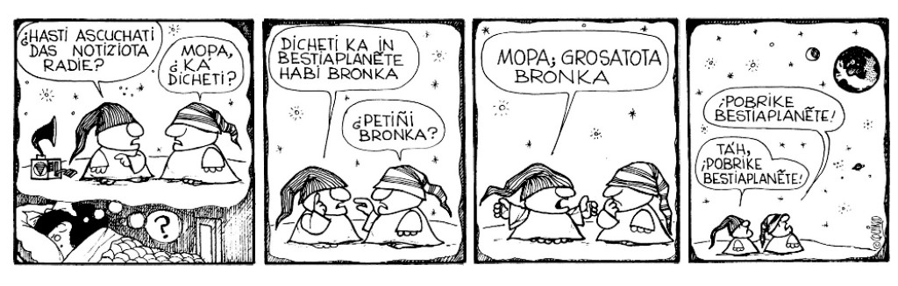

# Bestiaplanete 2.0-alpha



_Bestiaplanete 2.0_ (con las disculpas de [Quino](https://www.quino.com.ar/)) es un motor de [planetas](https://es.wikipedia.org/wiki/Planeta_(agregador)) hecho con [Vendimia](https://vendimia.in/). Corre en [PHP](https://php.net) 8.2+ con [SQLite 3](https://www.sqlite.org/) o [MariaDB](https://mariadb.org/)/[MySQL](https://www.mysql.com/).

Por ahora, solo soporta [JSON feed](https://www.jsonfeed.org/version/1.1/).

## Instalación

A parte de PHP 8.2 con `mbstring` y el módulo para la base de datos (por defecto es `sqlite3`), requires [`git`](https://git-scm.com/) y [`composer`](https://getcomposer.org/).

```bash
git clone https://github.com/drmad/bestiaplanete
cd bestiaplanete
composer update
```

Si vas a usar MariaDB/MySQL, debes crear la base de datos, y modificar el fichero `config/default.php` con los parámetros de conexión en el índice `database`, con la siguiente estructura:

```php
'database' => [
    'connector' => Vendimia\Database\Driver\Mysql\Connector::class,
    'options' => [
        'database' => 'basedatos_bestiaplanete',
        'username' => 'usuario_bestiaplanete',
        'password' => '*************',
    ],
],
```

Si vas a usar `sqlite3`, no requieres configurar nada.

Luego, ejecutas la migración de la base de datos:

```
./bin/migrate
```

### Instalación con Nginx

En la definición del servidor puedes poner algo así:

```
location / {
    fastcgi_pass unix:/run/php/php8.2-fpm.sock;

    fastcgi_param SCRIPT_FILENAME /ruta/a/la/instalación/de/bestiaplanete/bootstrap.php;
    fastcgi_param VENDIMIA_ENVIRONMENT production;

    include fastcgi_params;
}
```

Debes cambiar el valor de `fastcgi_pass` a la ruta del socket de PHP-FPM, también debes cambiar la ruta de `SCRIPT_FILENAME`.

### Configuración de blogs

Primero creas un usuario para el dueño del blog:

```
./bin/crear-usuario alias nombre_completo
```

El `alias` debe ser una palabra simple alfanumérica en minúsculas. El nombre completo puede contener espacios, mayúsculas, y otros símbolos.

Luego añades un blog a un usuario:

```
./bin/añadir-blog alias-usuario url-feed
```

`alias-usuario `es el alias del usuario creado en el paso anterior, `url-feed` es la URL completa del feed del blog.

### Obtención de blogs

El script `./bin/obtener-posts` debe ejecutarse regularmente para obtener los posts configurados.

## Hackergotchis

Los hackergotchis deben ir en la carpeta `public/hackergotchi` (debes crearla si no existe), y deben ser imágenes JPG de 512×512. Cada usuario tiene un código autogenerado que se usa para el nombre del fichero. Por ahora puedes obtenerlo desde la misma web o viendo la tabla `usuarios_usuario` de la base de datos.